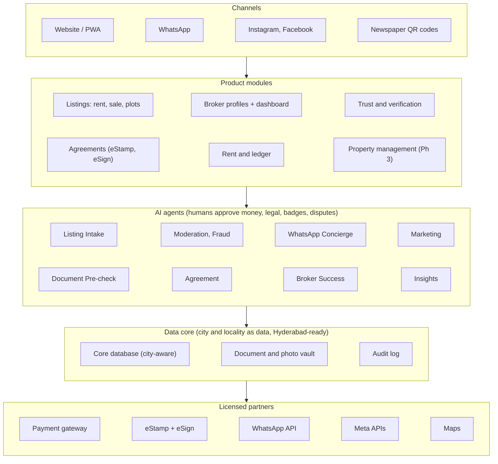
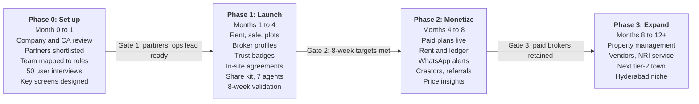

# Tricity Property Platform: Product Spec

_Last updated 2026-09-28 by Rajender. Source: the Claude Docs spec; edit it there and re-export._

## Executive summary

We will build the most trusted place to buy, sell and rent property in Warangal, Hanamkonda and Kazipet (the Tricity), then expand to Hyderabad and other Telangana towns. The platform covers the full journey inside one responsive website: listing, discovery, verification, agreement, monthly rent and, later, property management.

Three choices make it different from national portals:

- **Trust first.** Owner OTP checks, document checks by an advocate partner, and clear Owner vs Verified Broker labels.
- **Social-first distribution.** Every listing and every broker profile becomes a shareable link, reel, WhatsApp status card and newspaper classified that leads back to the site.
- **Agent-run operations.** AI agents handle intake, moderation, lead handling, marketing, document pre-checks and agreements, so a small team runs the business.

ROI comes from recurring revenue: broker subscriptions, paid promotions, agreement fees, builder and layout campaigns, and later NRI property management and vendor commissions. Buyers and tenants never pay, because their traffic is what makes everything else sellable.

## Problem and opportunity

Tricity property deals still run mostly offline, through local brokers, WhatsApp groups, Facebook groups, Instagram pages and newspaper classifieds. Nobody offers a trusted, searchable, local home for them.

**What goes wrong today**

- Fake, duplicate or already-sold listings waste time.
- Plot buyers face unclear titles and unapproved layouts.
- Brokers hide the owner, and owners cannot tell serious leads from time-wasters.
- Nobody publishes a reliable fair price per locality.
- Agreements, rent and repairs are handled by paper, cash and phone calls.

**What the market check showed (September 2026)**

- Online supply is thin: RealEstateIndia shows about 43 owners offering rentals across Warangal ([source](https://www.realestateindia.com/warangal-property/property-for-rent.htm)), and Sulekha lists 11 properties for sale in Hanamkonda ([source](https://property.sulekha.com/residential-property-for-sale/hanamkonda-warangal)).
- The rest sits on small broker sites and social posts.
- NoBroker's verified listings cover large metros such as Bangalore, Mumbai, Delhi, Chennai, Hyderabad and Pune, not Warangal ([source](https://play.google.com/store/apps/details?id=com.nobroker.app)).
- Managed renting is a proven model in metros: NoBroker charges 8% of monthly rent for its rental-guarantee management service ([source](https://www.nobroker.in/blog/nobroker-com-launches-property-management-services-with-rental-guarantee-for-owners/)).

**Why now**

- Aadhaar eSign and e-stamping make fully digital rent agreements possible in Telangana.
- UPI AutoPay makes recurring rent collection simple.
- AI makes Telugu voice listing, fraud checks and 24/7 WhatsApp support affordable for a small team.

## Vision, positioning and value

**Vision:** every property deal in the Tricity starts, is agreed and is managed on one trusted platform.

**Positioning:** the local, verified, Telugu-first alternative to scrolling random groups and national portals. Social media is our distribution channel, not our competitor.

**The full lifecycle**

1. List (by form, WhatsApp, voice note or pasted social post)
2. Discover and enquire (search, locality pages, WhatsApp alerts)
3. Verify (owner OTP, document check)
4. Agree (e-stamped, Aadhaar eSigned agreement)
5. Pay (monthly rent, receipts, ledger)
6. Maintain (repair tickets, vendors, inspections)
7. Move out (inspection, transparent deposit settlement)

**Customer value vs business value**

| Who | What they get | What we earn |
| --- | --- | --- |
| Tenants and buyers | Verified listings, real photos, fair-price data, direct WhatsApp contact, alerts | Free (they bring the traffic) |
| Owners | Free basic listing, serious leads, Telugu voice posting, agreements, rent tools | Boosts, agreement fees, verification fees |
| Brokers and agents | Profile page as a free website, leads inbox, marketing kit, analytics | Monthly subscriptions |
| Builders and layout developers | Project pages, targeted buyers, creator campaigns | Promotion packages, cost per lead |
| NRI owners | Listing, renting and managing a property from abroad | Monthly management fee |
| Vendors (later) | Steady repair jobs | Commission per job |
| Creators | Paid shoots and affiliate income | Commission on bookings |

## Target users

| Persona | Main need | Where they are today |
| --- | --- | --- |
| Students (NIT Warangal, Kakatiya University, medical colleges) | Safe rooms and flats near campus, semester terms | WhatsApp groups, word of mouth |
| Working tenants (railway staff at Kazipet, IT park at Madikonda, government, teachers) | Genuine rentals, fast visits | Brokers, Facebook groups |
| Home buyers | Verified houses and flats, fair price | Brokers, national portals |
| Plot buyers | Clean title, approved layout | Brokers, layout developers, newspaper |
| Local owners | Quick serious tenants or buyers with little effort | Newspaper, WhatsApp status, brokers |
| Brokers and agents | Steady leads and a digital storefront | Instagram pages, WhatsApp groups |
| Builders and layout developers | Sell projects and plots faster | Newspaper, Instagram, hoardings |
| Hyderabad and NRI owners of Tricity property | Rent and manage a property from far away | Relatives, local brokers |
| Vendors (later) | Regular jobs | Word of mouth |
| Local creators | Paid property content | Instagram |

## Key product decisions

| Decision | Choice | What it means |
| --- | --- | --- |
| Launch market | Tricity first, Hyderabad-ready build | City and locality are data; Hyderabad and other towns are added by configuration |
| Categories at launch | Rentals, sales and plots from day one, plus commercial | One listing engine with category-specific fields and different verification depth |
| Broker stance | Both brokers and owners | Every listing labeled Owner or Verified Broker; buyers can filter Owner only |
| Platform surface | Responsive website / PWA first | No native apps until usage justifies them |
| Transactions | Agreements and rent happen inside the site | eStamp, eSign and payment gateway partners; we never hold money ourselves |
| Operations | AI agents first, small human team | Humans approve anything touching money, legal status, badges or disputes |
| Team | Existing team in India | Tech and marketing can be anywhere; ops roles sit in the Tricity |
| Distribution | Social-first | Every listing and profile is a shareable link, reel, status card and classified |

## Core marketplace

One listing engine serves every category. Each category adds its own fields and its own level of verification.

| Category | Key fields | Verification |
| --- | --- | --- |
| Rentals (house, flat, room, PG) | Rent, deposit, furnishing, tenant preference, available from | Light: owner OTP, real photos |
| Sales (house, flat, villa) | Price, area, age, facing, floor, parking | Medium: ownership documents |
| Plots | Size in sq. yards, survey number, layout name, road width, approval status | Strict: title, encumbrance certificate, layout approval |
| Commercial (shop, office, godown) | Rent or price, area, frontage, usage type | Medium |

**Posting a listing**

- Simple form in Telugu or English.
- WhatsApp: forward photos and a message, and the Intake agent drafts the listing.
- Telugu voice note: speak the details, and the agent writes a bilingual listing.
- Paste an Instagram or Facebook post link, or photograph a newspaper ad.
- The owner confirms with an OTP before anything goes live.

**Finding a property**

- Filters by category, locality, budget, BHK, furnishing, Owner only, Verified only.
- Map view with locality boundaries.
- Locality pages (Hanamkonda, Kazipet, Subedari, Hunter Road and others) with average prices and live listings. These also bring free search traffic.
- Saved searches with instant WhatsApp alerts.
- Visit booking with reminders to both sides.

**Contact**

- WhatsApp and call buttons, tracked as leads.
- Owners choose whether brokers may contact them.
- Listings expire unless the owner or broker confirms they are still available.

**Language:** Telugu and English everywhere, with a one-tap switch.

## Broker and agent profiles

Every broker gets a public profile page that works as their own website, plus a private dashboard that works as their CRM. They share one link anywhere, and it always shows their current listings.

**Public profile (what visitors see)**

- Photo, name, agency, years of experience, localities served, languages, RERA number if registered.
- Badges: Verified Broker, average response time, listings with checked documents.
- All live listings as a filterable grid (rent, sale, plots, commercial).
- Reviews only from people who contacted them or closed a deal through the platform.
- Tracked WhatsApp, call and request-a-visit buttons.
- A profile page shows only that broker's listings, never competitors or ads.

**Sharing**

- A clean link such as `yoursite.com/agent/ramesh-realty` for Instagram bio, WhatsApp status, Facebook and visiting cards.
- Rich link previews (Open Graph): photo, name, live listing count and a featured property.
- A QR code for visiting cards, property boards and newspaper ads.
- Per-listing links and QR codes that also lead back to the profile.
- Every link carries a source tag, so leads are attributed to Instagram, WhatsApp, newspaper or site.

**Private dashboard**

- Leads inbox with source and a pipeline: New, Contacted, Visit booked, Closed.
- Listing performance: views, leads, saves, and a price suggestion.
- Quick posting by forwarding a WhatsApp message or voice note.
- One-tap marketing kit per listing.
- Visit calendar with reminders.
- Agreements for their clients, created through the platform.
- Plan and billing.

**Broker plans**

| Plan | Includes |
| --- | --- |
| Free | Basic profile, limited listings, WhatsApp contact |
| Pro | Unlimited listings, leads inbox and pipeline, marketing kit, analytics, Verified badge |
| Agency | Team members under one agency page, lead assignment, custom URL and branding |

The same profile system later serves builders and layout developers (company page plus project pages) and vendors.

## Trust and verification

Trust is the product. Every badge states exactly what was checked, and legal sign-off always comes from the advocate partner, not from us.

| Badge | What it means | Who checks |
| --- | --- | --- |
| Owner verified | Phone OTP matches the lister; photos are real and recent | Moderation agent, spot checks by field staff |
| Verified Broker | Identity, office address and, where applicable, RERA registration checked | Ops lead |
| Documents checked | Title, encumbrance certificate and approvals reviewed against a listed checklist | Document agent prepares, advocate signs off |
| Site visited | Field executive visited and photographed the property | Field executive |

**Rules**

- Plots are promoted only after the documents check.
- Brokers cannot post as owners; phone numbers are matched against the broker registry.
- Stale listings auto-expire; repeat offenders are suspended.
- Wording stays specific, such as "Documents checked by [advocate partner] on [date]", never a blanket "100% safe".
- Buyers and tenants can report a listing in one tap.

## Agreements and rent payments

Agreements and rent both happen inside the site through licensed partners. We handle the flow and the records; partners handle stamping, signatures and money.

**Agreements**

- Legal basis: Telangana rent agreements can be signed with Aadhaar eSign under Section 3A of the IT Act, 2000 ([source](https://www.edrafter.in/telangana-rent-agreement/)).
- Flow: owner and tenant enter terms, the Agreement agent drafts a bilingual agreement, both review, the eStamp is attached through a partner API, both sign with Aadhaar OTP, and the signed PDF is stored in both accounts.
- Default term: 11 months. Leases longer than one year need compulsory registration ([source](https://www.edrafter.in/telangana-rent-agreement/)), so longer terms route to a registration step.
- Stamp duty: published sources disagree, so the advocate confirms current rates before any calculator goes live.
- Also supported: sale agreement drafts for review by the parties' lawyers, and renewal reminders.
- Revenue: a fee per agreement, paid by owner, tenant or broker.

**Rent payments**

- We never hold money. A licensed payment gateway settles rent straight into the owner's bank account.
- UPI AutoPay: after a one-time setup, recurring payments up to ₹15,000 debit without a fresh check; larger amounts need approval each time ([source](https://support.google.com/pay/india/answer/10452280?hl=en)). Most Tricity rents fall under that limit.
- Owners get reminders, a rent ledger, late-fee tracking and monthly statements.
- Tenants get automatic rent receipts for HRA claims and a payment history.
- Paying through the site is free for tenants. Rent tools are a retention feature, not the main revenue line.
- Security deposits are recorded (amount, holder, move-in condition) at first. Escrow comes later, through a bank partner.

## Property management and maintenance (Phase 3)

Owners, especially NRI and Hyderabad-based owners, manage their Tricity property entirely through the site, US-style.

**Maintenance flow**

1. Tenant raises a ticket with a photo or video.
2. The Dispatcher agent triages it and gets a quote from the vendor rate card.
3. Owner approves (or we approve, for managed properties).
4. A vendor is assigned and the tenant gets a visit time.
5. Vendor uploads before and after photos.
6. Payment happens on the platform; the tenant rates the job.

**Vendor network:** plumbers, electricians, carpenters, AC repair, painters, pest control, cleaning. Vendors work through a simple WhatsApp job flow with a fixed rate card, because many will not use an app.

**Managed properties**

- Tenant finding, agreement, rent collection, repairs and a monthly owner report.
- Move-in and move-out photo inspections, so deposit deductions are transparent.
- Fee: a percentage of rent or a flat monthly fee.

**Revenue:** vendor commission per job plus management fees.

## Social, creators, WhatsApp and newspaper

Post once on the site, share everywhere, and every share brings leads back. Social platforms are our distribution channels.

**Outbound: one listing becomes a marketing kit**

- Instagram post, carousel and reel.
- WhatsApp status card (9:16) with QR code.
- Facebook post text in Telugu and English.
- Print-ready Telugu newspaper classified with a listing code such as TC-1042.
- A tracked short link and QR code on everything.

**How posting works**

- Our own Tricity pages: auto-posted, because the Instagram API publishes for Business and Creator accounts ([source](https://developers.facebook.com/docs/instagram-platform)).
- Brokers with professional accounts can connect and auto-post.
- Personal accounts, WhatsApp status and Facebook groups: a one-tap Share button.

**Inbound: existing posts become listings**

- Owners paste their own post link, forward a WhatsApp message or photograph their newspaper ad.
- The Intake agent reads it, including Telugu, and drafts a listing for OTP confirmation.
- We import only what owners submit themselves; we never scrape other people's posts.

**Creators and influencers**

- Paid shoots: owners, brokers or builders book a local creator for a tour reel; we take a commission.
- Affiliates (Tricity Property Partners): creators, brokers and students earn per verified lead or closed rental through a unique link.
- Builder campaigns: several creators push one project or layout launch.
- Creators promote only verified listings, and paid posts are clearly marked as ads.

**WhatsApp alerts:** opt-in saved searches send new matches instantly through the WhatsApp Business API.

**Newspaper:** print-ready classifieds with QR codes now; booking the ad for owners as a paid service later.

**Attribution:** owners and brokers see where every lead came from, which is why they keep paying.

**Our own channel:** the platform's Instagram, Facebook and WhatsApp channel aims to become the biggest local property page, posting listings, locality price trends and new layout alerts.

## AI agent operating model

Agents do the repetitive work; humans keep every decision that touches money, legal status, trust badges or disputes. Every agent action is written to an audit log.

| Agent | What it does | Human checkpoint | Phase |
| --- | --- | --- | --- |
| Listing Intake | Turns forms, WhatsApp messages, Telugu voice notes, photos, post links and newspaper clippings into bilingual listings; asks for missing details | Owner confirms by OTP | 1 |
| Moderation and Fraud | Flags duplicates, stock photos, odd prices, brokers posing as owners, stale listings; pings owners to confirm availability | Ops lead reviews flags | 1 |
| Concierge (WhatsApp) | Answers enquiries 24/7, qualifies budget and timing, books visits, sends saved-search alerts | Hands off to owner or broker | 1 |
| Marketing | Builds reels, posts, status cards and classifieds; posts to our pages; tracks lead sources | Weekly review | 1 |
| Document Pre-check | Reads title, encumbrance and approval documents, including Telugu; builds a gap checklist | Advocate signs off | 1 |
| Agreement | Drafts agreements from a chat, runs eStamp and eSign, sends renewal reminders | Both parties sign | 1 |
| Broker Success | Onboards brokers, nudges inactive ones, suggests upgrades | Human closes paid deals | 1 |
| Insights | Builds the locality price index and price suggestions | None | 2 |
| Rent and Ledger | Reminders, receipts, late follow-ups, owner statements | Human handles disputes | 2 |
| Maintenance Dispatcher | Triages tickets, quotes from rate card, assigns vendors, follows up | Owner approves spend | 3 |

**Guardrails**

- Follow WhatsApp opt-in and message-template rules.
- Cap AI cost per listing and per conversation, and track it weekly.
- Test Telugu output with local users before launch.
- Agents never promise legal outcomes or quote unchecked prices.

**Development:** a team of 2 to 3 engineers working with coding agents builds and maintains the platform.

## Business model and pricing

Brokers, owners and builders pay; buyers and tenants never do. Prices below are starting hypotheses to test in the validation phase, not final numbers.

| Revenue stream | Who pays | Model | Starting hypothesis | Phase |
| --- | --- | --- | --- | --- |
| Broker Pro and Agency plans | Brokers | Monthly subscription | ₹999 to ₹2,999 per month | 1 |
| Listing boosts and Promote packages | Owners, brokers | One-time per listing | ₹199 to ₹499 per boost | 1 |
| Builder and layout campaigns | Developers | Package or cost per lead | Quoted per project | 1 |
| Document check | Owners, buyers | Per property | Advocate fee plus our margin | 1 |
| Agreements | Owners, tenants, brokers | Per agreement | Service fee plus stamp duty at cost | 1 |
| Creator bookings | Owners, brokers, builders | Commission | Share of booking value | 2 |
| Home loan and services referrals | Banks, movers, interiors, legal | Referral fee | Per partner agreement | 2 |
| Newspaper ad booking | Owners, brokers | Service fee | Per ad | 2 |
| NRI and managed properties | Owners | Percent of rent or flat monthly fee | Benchmark: NoBroker charges 8% of rent ([source](https://www.nobroker.in/blog/nobroker-com-launches-property-management-services-with-rental-guarantee-for-owners/)) | 3 |
| Vendor commission | Vendors | Per job | Share of job value | 3 |

**Leakage defence:** charge for tools and lead flow, not a cut of each deal, so there is nothing to gain by going around the platform. Rent payments stay free for tenants.

**Unit economics to track:** revenue per paid broker, cost to acquire a broker, AI cost per listing, and gross margin per agreement.

## Go-to-market

Supply first: nobody visits an empty site, so the first push is getting listings, then traffic.

**Supply**

- Onboard 30 to 50 local brokers free for the first 2 to 3 months.
- Field executives list and photograph properties by hand in the densest localities.
- Import owners' own posts, WhatsApp forwards and newspaper ads through the Intake agent.
- Sign 3 to 5 layout developers for launch campaigns on plots.

**Demand**

- Launch our Tricity Instagram, Facebook and WhatsApp channel with daily listings and locality price posts.
- Student rental drives near NIT Warangal and Kakatiya University before each semester.
- Locality pages for search traffic.
- QR boards on listed properties and QR codes in newspaper classifieds.

**Hyderabad and NRI owners (from day one, as customers)**

- Target Hyderabad families and US-based Telugu NRIs who own Tricity property.
- Offer: list, rent out and track your Tricity property from anywhere.

**Expansion order**

1. Tricity: prove the model.
2. Other tier-2 Telangana towns (Karimnagar, Khammam, Nizamabad): same playbook.
3. Hyderabad: niche entry (for example independent-house owners, Telugu-first owners or student housing), not a head-on fight with metro portals.

## Team and operations

A small team plus agents runs Phase 1. Ops roles must be physically in the Tricity; tech and marketing can sit anywhere, including Hyderabad.

| Role | Count | Location | Owns |
| --- | --- | --- | --- |
| Founder (Raj) | 1 | US | Product, architecture, AI agents, partnerships |
| Full-stack lead | 1 | India (any) | Platform build, payments and eSign integrations |
| Frontend developer | 1 | India (any) | Responsive web / PWA, Telugu UI |
| QA | Part-time | India (any) | Testing, Telugu output checks |
| City ops lead | 1 | Tricity | Broker onboarding, verification, disputes, agent flags |
| Field executives | 1 to 2 (can be paid per visit) | Tricity | Site visits, photos, owner checks |
| Social and content | 1 | India (visits Tricity) | Reels, our pages, creator partnerships |
| Advocate partner | Partner | Tricity | Document checks and legal sign-off |
| CA | Partner | India | Company setup, GST, cross-border compliance |

**Operating rhythm**

- Weekly metrics dashboard: live listings, leads, verified share, paid brokers, agreements, AI cost.
- Short daily async update from each owner.
- One clear owner per area; the founder reviews agent flags and metrics weekly.

## Technical architecture

One responsive web platform, one city-aware data core, an agent layer on top, and licensed partners for money, stamping, signatures and messaging.

Channels feed the product modules; agents do the repetitive work on the shared data core; partners handle everything regulated.

**Core data model**

| Entity | Key contents |
| --- | --- |
| User | Roles: owner, tenant, buyer, broker, builder, vendor, creator, admin; phone OTP; language |
| Agency | Broker team, members, plan, profile URL, branding |
| City and Locality | Name, boundary, price index; every record links to a city |
| Property and Unit | One building, many units (flats, shops); location, category |
| Listing | Unit, rent or sale, price, fields per category, status, lister type (Owner or Broker), badges |
| Lead | Listing, enquirer, source tag (Instagram, WhatsApp, newspaper, site), pipeline stage |
| Verification | Type, documents, checklist, reviewer, date, result |
| Lease / Agreement | Parties, terms, eStamp and eSign references, signed PDF, renewal date |
| Ledger entry | Rent charge, payment, deposit, late fee; gateway reference |
| Ticket, Job, Vendor, Invoice | Phase 3 maintenance flow |
| Share link | Short code, target (listing or profile), channel, clicks, leads |
| Audit event | Actor (human or agent), action, before and after, time |

**Recommended stack** (to confirm with the team)

- Frontend: Next.js PWA with server rendering for SEO, Telugu and English.
- Backend: TypeScript or Python API; job queue for agents and notifications.
- Data: PostgreSQL with PostGIS for maps and localities; object storage for photos and documents.
- AI: LLM APIs for Telugu understanding, OCR and drafting; per-call cost tracking.
- Hosting in an Indian cloud region.

**Hyderabad-ready by design**

- City and locality are data, never hard-coded.
- Legal rules (stamp duty, templates, registration) are stored per state and district.
- Admin roles are scoped per city.
- SEO pages are generated per city and locality.

## Legal and compliance

None of these block the launch, but each needs a named owner and professional advice before go-live. This section is a checklist, not legal advice.

- [ ] Incorporate an Indian private limited company (needed for payment gateway, eStamp partner and GST).
- [ ] CA review of foreign investment (FEMA) rules for a US-resident founder owning or funding the company.
- [ ] Founder checks own employment agreement, and visa terms if applicable, before running the venture.
- [ ] IP assignment and confidentiality agreements with every team member; code, domain, cloud and social accounts in the company's name.
- [ ] Payments only through a licensed payment gateway; we never hold customer money.
- [ ] Advocate confirms current Telangana stamp duty and registration rules for rent and sale agreements.
- [ ] Telangana RERA review: project ads show RERA numbers, and whether the platform needs agent registration if it ever takes commissions.
- [ ] Data protection (DPDP Act) compliance: consent, retention and deletion; no Aadhaar numbers stored, KYC left to the eSign provider.
- [ ] Influencer ad disclosure rules for paid creator posts.
- [ ] WhatsApp Business API opt-in and template policies.
- [ ] Terms of use and a liability-scoped wording for every trust badge.

## Roadmap

Phase 1 launches all three categories with agreements, then an 8-week validation decides whether we invest in rent tools and property management.

Each phase starts only when its gate is met; durations are proposed and depend on team size. The 8-week targets for Gate 2 are in Success metrics.

## Success metrics

The 8-week validation targets decide whether we build the full platform. They are proposed targets to agree as a team.

| Metric | 8-week validation target | Why it matters |
| --- | --- | --- |
| Live listings (rent, sale, plots) | 300+ | Proves we can get supply |
| Median genuine leads per listing | 5+ | Proves buyers and tenants come |
| Brokers willing to pay | 15 to 20 | First recurring revenue |
| Paid agreements | 20+ | Proves in-site transactions work |
| Layout developers on paid campaigns | 3+ | Early plot revenue |
| NRI and Hyderabad owners asking for management | 5+ | Demand for Phase 3 |
| Listings with verification badge | 60%+ | Trust is real, not a slogan |

**Ongoing north-star:** monthly active tenancies and deals that started on the platform. Supporting metrics: paid broker retention, lead response time, AI cost per listing, and share of leads from social links.

## Risks and mitigations

| Risk | Impact | Mitigation |
| --- | --- | --- |
| Scope too big: marketplace, agreements, payments, management and creators at once | Slow launch, thin quality everywhere | Strict phases; Phase 1 ships only the marketplace, profiles, trust, agreements and the share kit |
| Empty site at launch | No traffic, no brokers | Free broker onboarding, field listing, post imports, developer campaigns |
| Users go around the platform | Lost revenue | Charge for tools and lead flow, not per deal; free rent payments for tenants |
| Broker and owner-direct conflict | Brokers leave | Clear labels, Owner-only filter, broker-friendly plans and profiles |
| Wrong "verified" claim on a plot | Reputation and legal exposure | Scoped badge wording; advocate signs off; promote plots only after checks |
| Small market and low ticket size | Revenue ceiling | Multi-city build; expand to tier-2 towns, then a Hyderabad niche |
| Social media works "well enough" for owners | Weak switching reason | Offer what social cannot: search, verification, agreements, alerts, lead tracking |
| AI errors in Telugu or fraud checks | Bad listings, lost trust | Human checkpoints, audit logs, local user testing |
| AI and WhatsApp costs grow | Margin loss | Per-listing and per-conversation cost caps, weekly tracking |
| Remote founder | Slow decisions | Local ops lead with authority, weekly metrics review |
| National portal or NoBroker enters the Tricity | Price pressure | Local trust, Telugu-first experience and broker relationships as the moat |

## Open questions and next steps

**Open questions**

- Brand name and domain.
- Current team: how many people, which roles, and whether they sit in Hyderabad or the Tricity.
- Who is the city ops lead in the Tricity?
- Which advocate, eStamp and eSign, and payment gateway partners?
- Final prices for broker plans, boosts and agreements after validation.

**Next steps**

- [ ] Pick the brand name and register the domain and social handles.
- [ ] Map the current team to the roles in Team and operations.
- [ ] Start company incorporation and the CA review.
- [ ] Interview 20 brokers, 20 tenants and 10 owners in the Tricity.
- [ ] Shortlist advocate, eStamp and eSign, and payment gateway partners.
- [ ] Design the listing page, broker profile and dashboard screens.
- [ ] Build Phase 1 and run the 8-week validation.

**Sources**

- [RealEstateIndia: property for rent in Warangal](https://www.realestateindia.com/warangal-property/property-for-rent.htm)
- [Sulekha: property for sale in Hanamkonda](https://property.sulekha.com/residential-property-for-sale/hanamkonda-warangal)
- [NoBroker app listing](https://play.google.com/store/apps/details?id=com.nobroker.app)
- [NoBroker: property management with rental guarantee](https://www.nobroker.in/blog/nobroker-com-launches-property-management-services-with-rental-guarantee-for-owners/)
- [eDrafter: Telangana rent agreement rules](https://www.edrafter.in/telangana-rent-agreement/)
- [Google Pay: UPI AutoPay limits](https://support.google.com/pay/india/answer/10452280?hl=en)
- [Meta: Instagram Platform](https://developers.facebook.com/docs/instagram-platform)
